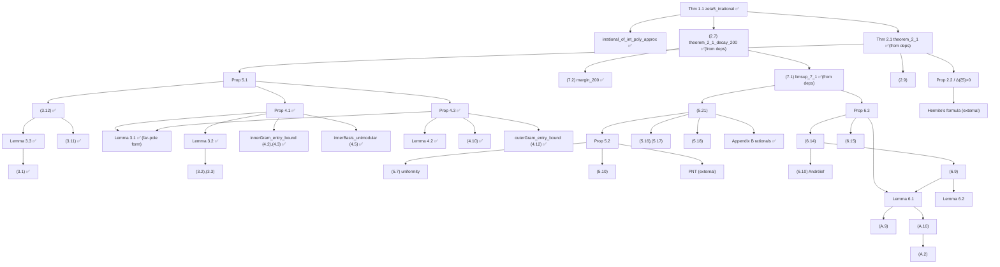

# Zeta5 Lean skeleton: blueprint and notes

`lake build` succeeds. `Main.lean`, `Section7.lean` and `AppendixB.lean` have no `sorry`.
Every other numbered result is stated with a `sorry` proof.

```
#print axioms Zeta5.irrational_of_int_poly_approx   -- propext, Classical.choice, Quot.sound
#print axioms Zeta5.zeta5_irrational                -- ... + sorryAx (from the section lemmas)
```

## Files

| File | Contents | `sorry`s |
|---|---|---|
| `Functionals.lean` | Cancellation/linearity of `µ_X`, `τ_X`; Lagrange decomposition; **pullback (3.1)** | 0 |
| `IntValued.lean` | Binomial polynomials, `τ(Δf) = [x⁴]f`, Newton; **(3.9)** as `tau_vge_of_values`, **(3.8)** as `diffQuot_vge` | 0 |
| `Lemma33.lean` | **Lemma 3.3** (residues, root counting, two-case estimate) | 0 |
| `SmallPrimes.lean` | `f_i(-x²)` integer-valued, **(3.11)**, **(3.12)** | 0 |
| `Lemma42.lean` | Lemma 4.2 (row-multilinear proof) | 0 |
| `MuMod.lean` | von Staudt–Clausen consequences: `v_p(µ(tᵉ)) ≥ -1`, κ bounds, `µ⁰` integral, **(4.10)** | 0 |
| `CRTBasis.lean` | CRT independence over `ZMod p`; **(4.11)** outer basis unimodular | 0 |
| `OuterCount.lean` | **(4.14)** `γ_out = 2∑w - min(r_p, z)` | 0 |
| `OuterEntries.lean` | **(4.12)**: cross-class, ordinary, `E_a` rows (two-node congruence), zero class | 0 |
| `Prop43.lean` | **Prop 4.3** assembled | 0 |
| `PadicTau.lean` | far-pole series (3.5): `tauAnPole_sub`, **Lemma 3.1 with far poles**, `C_p ∈ p⁵ℤ_p` | 0 |
| `Distribution.lean` | **Lemma 3.2** (Raabe + pole induction) | 0 |
| `InnerBasis.lean` | `L_a ≥ 0`, `∑L_a = h`, (4.5) unimodular, Prop 4.1 from entry bounds | 0 |
| `InnerEntries.lean` | per-class bounds (4.2)/(4.3) via pullback + (3.7) + Lemma 3.1 | 0 |
| `InnerFinal.lean` | inner-basis bookkeeping and half-weight inequalities; **Prop 4.1** | 0 |
| `Prop43Large.lean` | **Prop 4.3 for p > K** | 0 |
| `Valuation.lean` | Gauss-valuation toolkit: `vpGge` closed under sums, products, determinant terms | 0 |
| `Defs.lean` | All definitions: `µ_X`, `G_K`, `Δ_K`, `S_K`, `F_K`, `τ_X`, the p-adic `τ^ext`, `γ_p^in`, inner/outer bases, `γ_p^out`, `L_p`, `m_{K,M}`, `Q_{K,M}`, limiting functions, `w`, `V`, `ρ` | 0 |
| `Section2.lean` | `G` entries affine ✅, `G_eq_cancelled` ✅; Prop 2.2, `weight_pos`, positivity ((2.9) is in `Degree29.lean`) | 4 |
| `Section3.lean` | (3.1), Lemma 3.2, Lemma 3.3, `C_p ∈ p⁵ℤ_p`, (3.11), (3.12), κ facts ✅; (3.2), (3.3) and the finite-sum form of Lemma 3.1 remain (the far-pole form `lemma_3_1_rat` is proved) | 3 |
| `Section4.lean` | **Props 4.1 and 4.3 (both parts) ✅**, Lemma 4.2 ✅, (4.4)–(4.14) ✅; only `gammaIn_tie_independent` remains (unused) | 1 |
| `Section5.lean` | `m_{K,M} > 0` ✅; statements moved to `Prop51`, `Legendre5`, `Section5Final` | 0 |
| `Prop51.lean` | **Prop 5.1** ✅ | 0 |
| `Degree29.lean` | **(2.9)** ✅ | 0 |
| `Legendre5.lean` | **(5.3)** (for `K > 0`) ✅, outer uniformity ✅ | 0 |
| `Uniform57.lean` | **(5.7)** inner uniformity ✅ | 0 |
| `Integrals5*.lean` | **(5.10), ∫d = 9/640, (5.12)–(5.14), P mean, \|C\| < 16, (5.16), (5.17), (5.18)** ✅ | 0 |
| `Section5Final.lean` | aliases for the above; Prop 5.2 and (5.21) (need the PNT) | 2 |
| `PNT.lean` | the prime number theorem `θ(x)/x → 1` (external input) | 1 |
| `Section6.lean` | Lemma 6.1, (6.9) | 2 |
| `Energy6.lean` | **Lemma 6.2 (corrected, see 21)** ✅, **(6.11)** ✅ | 0 |
| `Section6b.lean` | **(6.15)** ✅, **(6.10)** ✅ (via Prop 2.2, through a general continuous Cauchy–Binet/Andréief identity); (6.14), Prop 6.3 | 2 |
| `AppendixA.lean` | Table 1 facts (proved by `decide`), (A.1), (A.2), (A.9), (A.10) | 4 |
| `AppendixB.lean` | Exact rationals: cancellation identity, `λM₀`, `A*`, `A_200`, `A_100000`, margins (7.2) | 0 |
| `Section7.lean` | Theorem 2.1, (7.1) and (2.7), **assembled from the lemmas above** | 0 |
| `Main.lean` | Theorem 1.1 from Theorem 2.1, and `riemannZeta 5` is real | 0 |

## Dependency graph



## Findings while formalising the definitions

1. **Outer basis, zero class (§4.2, after (4.12)).** The paper specifies the zero-class rows only
   as "the rows `1, t + p²`" (two poles `p, 2p`) or a single pole. `outerBasis` reads this as
   `P_0 · (t + p²)^i`, with `P_0 = D_tail / Q_0` as for the other classes. This should be
   confirmed with the author. The weights `-2, 0` (or `-1/2`) depend on the choice.
2. **Tie-breaking in `ε_a` (4.4).** The paper says ties "may be ordered arbitrarily". Taken
   literally, `γ_p^in` then depends on a choice. It does not, because the last row of class `a`
   has weight `T - (ℓ_K(a)+4)/2`, which is independent of `b_a`. The statement is
   `gammaIn_tie_independent`, and the definitions take the ordering as a parameter.
3. **`L_p` uses `⌊γ_p^in⌋`.** This is harmless: `γ_p^in = 2∑w` with half-integer weights, so it is
   trivially an integer (`gammaIn_isInt`). The floor just avoids needing that lemma inside a
   definition.
4. **(A.10) combination.** The rational endpoints combine to *exactly* `-1366995564511/10¹²`.
   The paper's strict inequality therefore rests on the strict enclosures in (A.10), not on
   slack in the arithmetic. Proved: `A10_combination`.
5. **Lemma 3.1** is stated for convergent series. The skeleton states it for finite sums, which
   gives the series version by continuity (`‖τ‖ ≤ p`). The far-pole values use (3.5)
   directly (`tauAnPole`). The paper's claim that expanding first and taking partial fractions
   first give the same value is built into this definition, and still needs to be justified
   when Prop 4.1 is proved.
6. **(5.7) outer range.** The paper states the outer approximation without a uniformity
   hypothesis. `uniformity_outer` assumes (4.9).

## Findings from the Phase 3 proofs

7. **(3.9) holds without the `-v_p(24)` term.** `τ(binom(x,k)) = [x⁴] binom(x,k+1)`, and
   `binom(x,n) = (x/n)∏(x/i - 1)` gives `v_p ≥ -4⌊log_p n⌋` directly. Lemma 3.3 is proved as
   stated. Its `v_p(24)` term is slack.
8. **Lemma 3.3 needs only values at integers.** The polynomial part is bounded at `K+1, …, K+1+d`,
   where no poles occur, then spread to all integers by Newton interpolation. The paper's
   `ℤ_p`-ball argument (3.8) becomes a difference-quotient bound via `binom(u,k)/u =
   binom(u-1,k-1)/k`. No step of the paper's proof failed. The two-case split (one pole
   p-adically close or none) is exactly as the paper describes.
9. **Lemma 4.2** is proved by a row-multilinear expansion instead of complementary minors.
   The half-integer, nonpositive weight hypothesis is used as stated.

10. **`kappa_padicVal_ge` as first stated was false at `p = 2`** (`κ₃ = 1/4`, `v₂ = -2`). This was
    an error in the skeleton, not the paper, which fixes `p ≥ 7`. The statement now assumes `p ≠ 2`.
11. **κ_d is integral further than stated.** It is `p`-integral for all `d ≤ 4p - 2`, not only
    `d ≤ p + 1` (Lemma 3.1's hypothesis is conservative).
12. **The paper's "congruent modulo p" step in (4.12) is correct.** Two residues at `a` and
    `p - a` combine into a divided difference. The needed congruence
    `µ_X(1/(t+a²)) ≡ µ_X(1/(t+(p-a)²))` reduces to `H⁽⁵⁾_{p-a} ≡ H⁽⁵⁾_{a-1}` (mod p). That in
    turn follows from pairing `v ↔ p - v` in `∑_{v=a}^{p-a} v⁻⁵`, using only that p is odd.
13. **The (4.14) closed form matches the definitions exactly** for every `(K, p)` satisfying (4.9).
    The paper's ℓ-table is right, and `40 ∣ K` is not needed there.

14. **The inner range needs only the `c ≠ 0` and `c = 0` summand bounds and a weaker spread of `ℓ_K`.**
    It suffices that all `ℓ_K(a)` lie in `[2⌊K/p⌋, 2⌊K/p⌋ + 2]`, together with the tie-ordering argument.
    The paper's "two consecutive values" claim is true but isn't needed. `L_a ≥ 0` also holds without
    `p > K/M`.
15. **Lemma 3.1 is proved in a "rational" form.** Far poles `s` with `v_p(s) = -1` get their series values (3.5).
    Integrality comes from the Taylor coefficients of `N/∏(u - pz)`, so no Tate-algebra formalism is needed.
    Together with Lemma 3.2 this covers everything Prop 4.1 uses.

16. **Skeleton error, now fixed: outer uniformity.** I had transcribed (5.7)'s outer analogue as
    `K R₀ − d`. The paper's display, whose large parentheses span both terms, means `K (R₀ − d)`.
    A numeric check exposed an error of about −0.225K near y = 1/3 (= −K·d(1/3), with d(1/3) = 3α).
    With the correct form the error stays ≤ 7, and it is now proved.
17. **Skeleton error, now fixed: Legendre (5.3) at K = 0.** The `(h−1)·v_p(4)` term uses integer
    subtraction, so the formula is false at K = 0. The statement now assumes `0 < K`.
18. **External input: the prime number theorem.** Prop 5.2 needs `θ(x) ~ x`, which Mathlib lacks.
    PrimeNumberTheoremAnd proves it but targets Lean v4.32.2. It is stated as the single `sorry`
    `prime_number_theorem` in `PNT.lean`, pending a port.
19. **(2.9) is proved** (`Degree29.lean`). The `X`-part of `G_K` is `Vᵀ·diag(w)·V` with `V`
    Vandermonde, and the sign is `(−1)^{h(h−1)/2}` as stated.

20. **§5 is proved except Prop 5.2 and (5.21).** (5.16) is tight: the proof has almost no
    room, and it goes through only with the exact values `P(20) = 37/2` and `C(20) = 0`. (5.14) holds for all
    `x > 0`, not only for `x ≥ 3`. The outer uniformity constant is 7 and the inner one is `1000M²`.
21. **Lemma 6.2 as first stated was false.** With Lean's convention `log 0 = 0`, point masses
    give counterexamples (`lemma_6_2_counterexample`). The corrected `lemma_6_2'` assumes the
    diagonal is null for `μ ⊗ μ`, which is what the paper uses. It no longer needs compact support.
22. **(6.15) has about `10h` of slack.** The `K² log K` and `K²` terms cancel exactly against
    `Cstar`; what remains needs only `log 4 + 4 log(37/20) ≤ 14`.

23. **Prop 2.2 is proved without Hermite's formula** (`Prop22.lean`). The polynomial part uses
    Gamma moments and `hasSum_zeta_nat`. The pole part uses the symmetry
    `c⁴Φ(a,c) = a⁴Φ(c,a)` (Fubini on `e^{-cy-au} sin(yu)`) and the coth series from Mathlib's
    `cot_series_rep'`. Positive definiteness and `Δ_K(ζ(5)) > 0` follow.
24. **Status (2026-09-23): the main theorem is fully proved.**
    `#print axioms Zeta5.zeta5_irrational` gives `[propext, Classical.choice, Quot.sound]`, where
    `zeta5_irrational : Irrational ζ5` and `ζ5 = (riemannZeta 5).re`. The prime number theorem is
    ported from PrimeNumberTheoremAnd (`PNTPort/`, about 4.2k lines, Apache-2.0, upstream commit a5154676).
    Upstream, `chebyshev_asymptotic` already depended only on the three standard axioms; the two
    upstream sorries (`prelim_decay_2/3`) are unused and were pruned. 4 sorries remain, all off the
    main line: §3 `tauX_reflect`, `tauX_difference` and the finite form of `lemma_3_1`, and §4 `gammaIn_tie_independent`.
25. **Lemma 6.1 and Appendix A are proved** (`Lemma61*.lean`). (A.10) uses atanh-series bounds for
    log, with accuracy about 1e-20 against a needed 5e-14. (A.9) on [0,2] uses a verified rational
    checker over 1052 intervals, run with `decide +kernel` (no `native_decide`), which takes about 4 minutes.
    (6.4) has only 6.45e-8 of room, and (6.2) about 5e-3.

## Phase 1 computational checks (`../checks/`)

All pass. Run each with `../.venv/bin/python <script>`.

| Script | Covers | Notes |
|---|---|---|
| `check_constants.py` | 1.1: (5.10), (5.18), Table 3, A*, A_M, margins (7.2) | exact rationals |
| `check_appendixA.py` | 1.2: (A.1), (A.2), (A.5), q±, Table 2 partition (684 intervals), (A.9), (A.10), (6.8), (A.11) | arb balls; worst B(l,r) = −6.645002689 on row (30,6,26), **margin only 6.9e-7**; dense scan max −6.64989 |
| `check_prop22.py` | 1.3: Prop 2.2 on monomials, poles, random R, G₄₀ entries; (6.11) | 60–400 digits |
| `check_determinant.py 40 80` | 1.3/1.5: (2.9), (3.12), Prop 4.3, Δ_K(ζ5) > 0 | Prop 4.3 is **attained with equality** at most outer primes |
| `check_section3.py` | 1.4: (3.1)–(3.3), (3.6), (3.7) p-adically, Lemmas 3.1 and 3.3, κ/µ valuations, (3.11) | exact |
| `check_local.py` | 1.5: Lemma 4.2 (4500 random), inner combinatorics at K ≥ 200M², inner entry bounds (4.2)/(4.3), outer (4.10)–(4.14) at K = 40, 80, 120 | see below |
| `check_uniformity.py` | 1.6: (5.7) up to K ≈ 2·10⁷ | error flat ≈ 145 |

Further observations from these checks:
- **Zero-class reading (finding 1) is consistent.** With `P_0 (t+p²)^i` and weights −2, 0 / −1/2,
  every outer entry bound holds and `2∑w − min(r_p, z) = γ_p^out` exactly, for all 36 primes
  tested at K = 40, 80, 120.
- **(4.12) and Prop 4.3 are sharp.** The minimum entry slack is 0 everywhere, and at K = 80
  `v_p^G(Δ_K) = γ_p^out` for every p ≥ 41. Any off-by-one in these weights would have shown up.
- **Inner entry bounds** were only tested with K < 200M² (M = 4, 5; K = 360–440). All the degree
  side conditions used in the proof hold there, but `p > 200M` does not. That is evidence for
  the hypothesis (4.1), not a test of it. 600 sampled entries, 0 violations, min slack 0.
- **Conservative constants.** κ_d is p-integral up to d = 4p−2 (the paper uses d ≤ p+1). Lemma 3.3
  was attained with equality in random tests.
- **Lemma 4.2** was attained with equality in 1722 of 4500 random cases.
